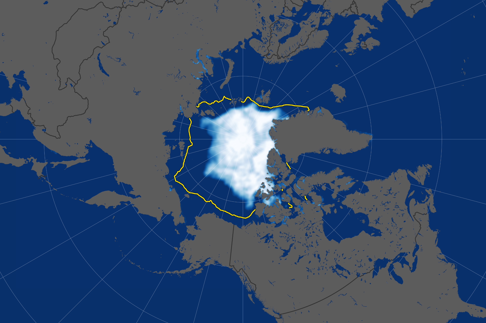

# Arctic Sea‐Ice Altimetry Interpolation with GPSat



## Background

To capture sea‐ice and ocean surface features, satellite radar altimetry employs a SAR‐mode radar that emits microwave pulses and measures return time and waveform properties (e.g., pulse peakiness) as the satellite moves along its orbit. Delay‐Doppler processing enhances along‐track resolution by combining multiple Doppler‐shifted echoes, enabling retrieval of sea surface height anomaly (SLA) and ice freeboard over leads and floes. However, these along‐track measurements remain spatially sparse and non‐uniform, motivating the use of data‐driven interpolation methods.

On the algorithmic side, we compare two interpolation paradigms: classical cubic‐spline interpolation, which fits smooth polynomials along the track coordinate, and Gaussian‐process regression (GPR), a Bayesian nonparametric approach that models SLA and freeboard as random functions with covariance kernels. The GPR implementation (via the GPSat toolkit) leverages localized “expert” subsets along the track to reduce computational cost while providing both predictions and uncertainty estimates. By combining these techniques, we can reconstruct continuous profiles of SLA and freeboard, filling measurement gaps and characterizing interpolation uncertainty.

Sea‐ice radar altimetry provides along‐track measurements of sea surface height anomaly (SLA) and ice freeboard at discrete points along satellite orbits. These observations are irregularly spaced and subject to gaps where the satellite does not traverse or where data are flagged as low quality (e.g., leads vs. floes). Reliable interpolation is therefore essential to reconstruct continuous SLA and freeboard profiles, quantify uncertainties, and enable detailed mapping of sea‐ice thickness and local ocean dynamics over polar regions.

Over a \~48‐hour observational window in the Arctic region (2019‑01‑10 00:22 UTC to 2019‑01‑11 19:17 UTC), we employ two distinct interpolation strategies:

## Interpolation Methods

### 1. Sparse Gaussian‐Process Regression (GPSat Toolkit)

**Notebook:** `Chapter_2_SLA_GPSat_GPOD.ipynb`

* **Input:** GPOD‐processed Sentinel‑3 SAR Level‑1A `.proc` files parsed into a consolidated CSV (`df_GPOD.csv`) containing longitude, latitude, SLA, error estimates, freeboard, and pulse peakiness.
* **Approach:** We build a Sparse Gaussian‐Process Regression (SGPR) model using the GPSat package. The workflow defines a set of local “expert” subsets along the satellite tracks, fits a Gaussian process to each subset, and then stitches the predictions onto a regular grid.
* **Outputs:** Gridded SLA fields, uncertainty maps, and scatterplots comparing observed vs. predicted SLA.
* 
* ## The Sentinel-3 SAR Altimeter (SRAL)

The Sentinel-3 mission, operated jointly by ESA and EUMETSAT, carries a state-of-the-art Synthetic Aperture Radar Altimeter (SRAL) designed to deliver precise sea surface height and ice-surface elevation measurements. Unlike conventional pulse-limited altimeters, SAR altimetry exploits along-track Doppler processing to synthetically narrow the instrument’s footprint, achieving finer spatial resolution (≈300 m) and higher signal-to-noise ratios, especially over complex surfaces such as sea-ice and coastal zones.

## The Sentinel-3 SAR Altimetry Product Suite

Sentinel-3’s SAR Radar Altimeter (SRAL) delivers a tiered set of processing levels tailored for both open-ocean and sea-ice applications:

| Product                             | Product Code    | Description                                    | Main Use                                         |
|-------------------------------------|-----------------|------------------------------------------------|--------------------------------------------------|
| Full Bit-Rate Waveforms             | L1A (FBR)       | Raw SAR echoes sampled at full bit-rate        | Input to advanced retrackers (e.g. SAMOSA+, ALES+) |
| Delay-Doppler Waveforms             | L1B (DD-FBR)    | On-ground Delay-Doppler processing of FBR data | Achieves ~300 m along-track resolution            |
| Ocean Altimetry                     | SR_2_OCN        | Sea Surface Height Anomaly over open water     | Global SLA mapping and ocean circulation studies |
| Land/Ice Altimetry (Sea Ice)        | SR_2_LAN_SI     | Along-track height & freeboard over ice floes & leads | Sea-ice freeboard and thickness estimation       |
| Pulse Peakiness & Quality Flags     | –               | Statistical metrics on waveform shape         | Filters low-confidence returns, surface classification |


## Remote Sensing Data & Processing Workflow


This project relies on Sentinel-3’s SAR Radar Altimeter (SRAL) to obtain high-resolution along-track measurements of sea surface and ice-surface height. The end-to-end processing chain is as follows:

1. **Waveform Acquisition (Level-1A FBR)**  
   - SRAL transmits and records full-bit-rate radar echoes (FBR) over ice-covered regions.  
   - Raw waveforms capture fine echo structure needed for high-precision retracking.

2. **Delay-Doppler Processing (Level-1B DD-FBR)**  
   - On-ground Delay-Doppler (DD) processing coherently integrates pulses to narrow the along-track footprint (~300 m).  
   - Generates high-resolution DD waveforms for subsequent retracking.

3. **Retracking & Geophysical Parameter Extraction (Level-2)**  
   - Apply retrackers (e.g., SAMOSA+, ALES+) to DD waveforms to locate the leading edge.  
   - Combine retracked ranges with precise orbit data and ancillary corrections (tides, dry/wet troposphere, ionosphere, sea‐state bias).  
   - Output Level-2 products in CF-compliant NetCDF:  
     - **Sea Level Anomaly (SLA)**  
     - **Radar Freeboard** (ice height above local water level)  
     - **Pulse Peakiness & Quality Flags**

4. **Regional Focus & Data Selection**  
   - Extract all Level-2 “Land-Ice” (SR_2_LAN_SI) tracks over the Arctic for 2019-01-10 00:22 UTC to 2019-01-11 19:17 UTC via GPOD `.proc` files.  
   - Parse each track into a Pandas DataFrame of (`lon`, `lat`, `time`, `SLA`, `freeboard`, `peakiness`, `quality_flag`, `ice_class`).

5. **Along-Track Interpolation & Analysis**  
   - Compare classical 1D cubic-spline interpolation with Sparse Gaussian Process (GPSat) models applied in sliding windows.  
   - Evaluate performance using RMSE, bias, and correlation on held-out track segments.  
   - Visualize observed vs. interpolated profiles and map-based gridded outputs.

---


### Synthetic Aperture Radar Mode

In SAR mode, the SRAL transmits a burst of radar pulses at L-band frequency toward the Earth’s surface. Echoes are recorded at full bit-rate (FBR), capturing fine waveform structure. Onboard and on-ground Delay-Doppler processing coherently combines these pulses, synthesizing a narrower along-track antenna beam. The result is a set of high-resolution waveforms whose leading edge can be retracked to estimate the range to the surface with centimetric accuracy.

### Retracking and Geophysical Products

Once Level-1A FBR waveforms are generated, retracking algorithms (e.g., SAMOSA+ or ALES+) fit a model to the leading edge to locate the point of closest approach. The retracked ranges, combined with precise orbit data and corrections for dry and wet troposphere, ionosphere, sea state bias, and tides, yield Level-2 geophysical parameters:
- **Sea Level Anomaly (SLA)**: deviation of the instantaneous sea surface from a long-term mean  
- **Radar Freeboard**: height of ice floes above the surrounding water level  
- **Pulse Peakiness & Quality Flags**: indicators of surface complexity and retracker confidence  

These L2 products are packaged in CF-compliant NetCDF files, providing along-track time, latitude, longitude, elevation, and ancillary metadata.

### Applications in Sea-Ice Studies

Thanks to its fine along-track resolution and robust retracking over heterogeneous surfaces, SRAL L2 data are ideal for studying Arctic and Antarctic sea-ice. In this project, we leverage SRAL’s Level-2 Sea-Ice Altimetry (`SR_2_LAN_SI`) product—covering both ice floes and open leads—to perform along-track interpolation, compare classical spline and Gaussian-process methods, and quantify uncertainties in sea-ice freeboard and sea-level anomaly estimates.


### 2. Classical Cubic‐Spline Interpolation & Along‐Track Comparison

**Notebook:** `Chapter_2_GPSat_along_track.ipynb`

* **Input:** The same GPOD `.proc` files and their parsed DataFrame of along‐track measurements.
* **Approaches:**

  1. **Cubic‐Spline Interpolation:** A one‐dimensional cubic spline is fit to each satellite track independently, interpolating SLA (and freeboard) along the track coordinate.
  2. **Gaussian‐Process Interpolation:** Using GPSat, a one‐dimensional Gaussian‐process regressor is trained on the same track data to produce continuous predictions with uncertainty estimates.
* **Comparison:** Side‐by‐side profile plots and error metrics (RMSE, bias) quantify performance differences between spline and GP methods along each track.

## Repository Structure

```text
.
├── data/
│   ├── *.proc                        # GPOD-provided Sentinel-3 .proc files
│   └── df_GPOD.csv                   # Parsed CSV for SLA notebook
├── notebooks/
│   ├── Chapter_2_SLA_GPSat_GPOD.ipynb
│   └── Chapter_2_GPSat_along_track.ipynb
├── requirements.txt                  # Python dependencies
├── environment.yml                   # Conda environment file
└── README.md                         # This document
```

## Installation

1. **Clone repository**:

   ```bash
   git clone https://github.com/yourusername/Arctic-Altimetry-Interpolation.git
   cd Arctic-Altimetry-Interpolation
   ```

2. **Set up environment**:

   ```bash
   conda env create -f environment.yml   # or create venv + pip install
   pip install -r requirements.txt
   pip install -e .
   ```

## Data Acquisition

* **GPOD .proc files**: Place the provided Sentinel‑3 SAR `.proc` files into `data/`. These cover 2019‑01‑10 00:22 UTC to 2019‑01‑11 19:17 UTC.
* **Parsing:** Run the first cells of either notebook to convert `.proc` files into `data/df_GPOD.csv`.

## How to Run

1. **Notebook 1** (`Chapter_2_SLA_GPSat_GPOD.ipynb`):

   * Load `df_GPOD.csv`, configure GPSat parameters, fit SGPR models, and generate gridded SLA and uncertainty outputs.

2. **Notebook 2** (`Chapter_2_GPSat_along_track.ipynb`):

   * Load `df_GPOD.csv`, parse individual tracks, apply cubic‐spline and GP interpolations, and compare along‐track profiles with error metrics.

Each notebook contains detailed comments, inline plots, and example parameter settings to reproduce the full analysis in Colab or Jupyter.

## License

This project is licensed under the **MIT License**.

## Contact

For questions or feedback, please open an issue or contact **Your Name** at [your.email@example.com](mailto:your.email@example.com).
